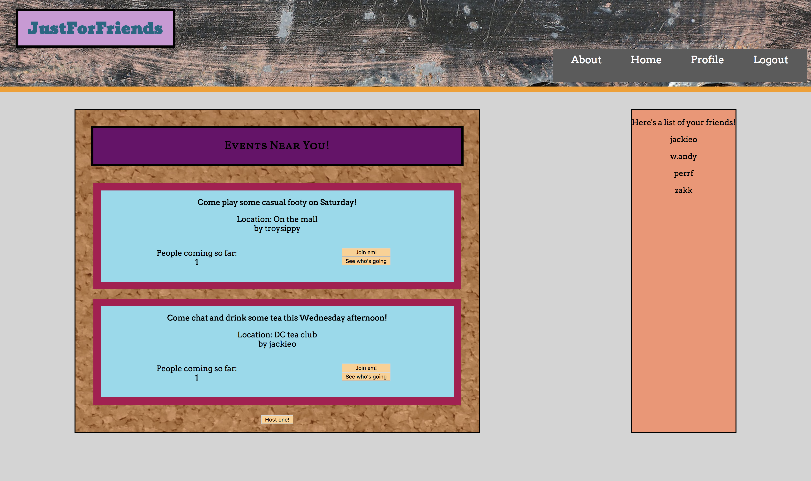

### SOCIAL NETWORK APP

## Goal

To build an app that makes moving to a new city easy and fun. I wanted functionality to set a user's location and see the events that other users from the same city had posted so that newcomers could get out, see the sights, and meet new and interesting people. I also wanted to implement the capability for a user to friend other users that they had met at events they had attended so that people could grow their social circle in new environs.

The user authentication works, and currently everyone who visits the site can see any of the events posted. Further efforts would involve getting the app to recognize which user was signed in, which city they had selected, and filter events accordingly. The current app works for authentication and then provides an approximation of the views available to a signed in user "Troy Sipprelle."

## Steps

In building this app, I found both of these tutorials very helpful:

http://blog.slatepeak.com/build-a-react-redux-app-with-json-web-token-jwt-authentication/

https://blog.jscrambler.com/implementing-jwt-using-passport/

The front-end dependencies are as follows:

"axios": "^0.17.1",
"babel-polyfill": "^6.26.0",
"cross-fetch": "^1.1.1",
"js-cookie": "^2.2.0",
"prop-types": "^15.6.0",
"react": "^16.2.0",
"react-cookie": "^2.1.2",
"react-dom": "^16.2.0",
"react-redux": "^5.0.6",
"react-router-dom": "^4.2.2",
"react-scripts": "1.0.17",
"redux": "^3.7.2",
"redux-form": "^7.2.0",
"redux-logger": "^3.0.6",
"redux-thunk": "^2.2.0"

The back-end dependencies are as follows:

"bcrypt": "^1.0.3",
"body-parser": "^1.18.2",
"cors": "^2.8.4",
"express": "^4.16.2",
"jwt-simple": "^0.5.1",
"method-override": "^2.3.10",
"mongoose": "^4.13.7",
"passport": "^0.4.0",
"passport-jwt": "^3.0.1"

To host the app locally, simply clone it down and npm install these packages.
